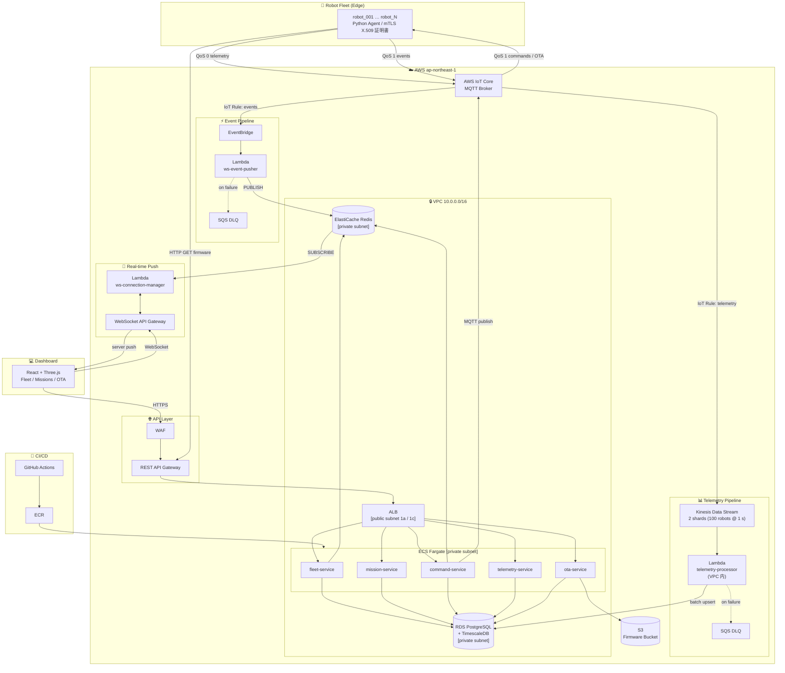
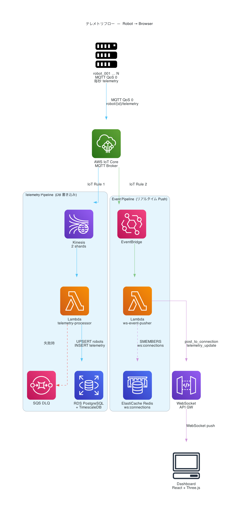
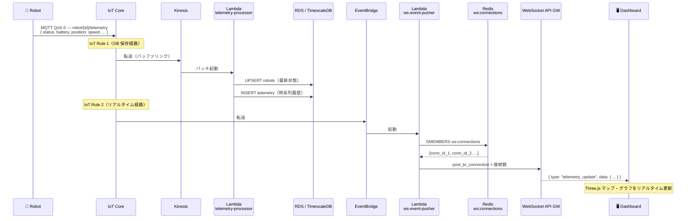
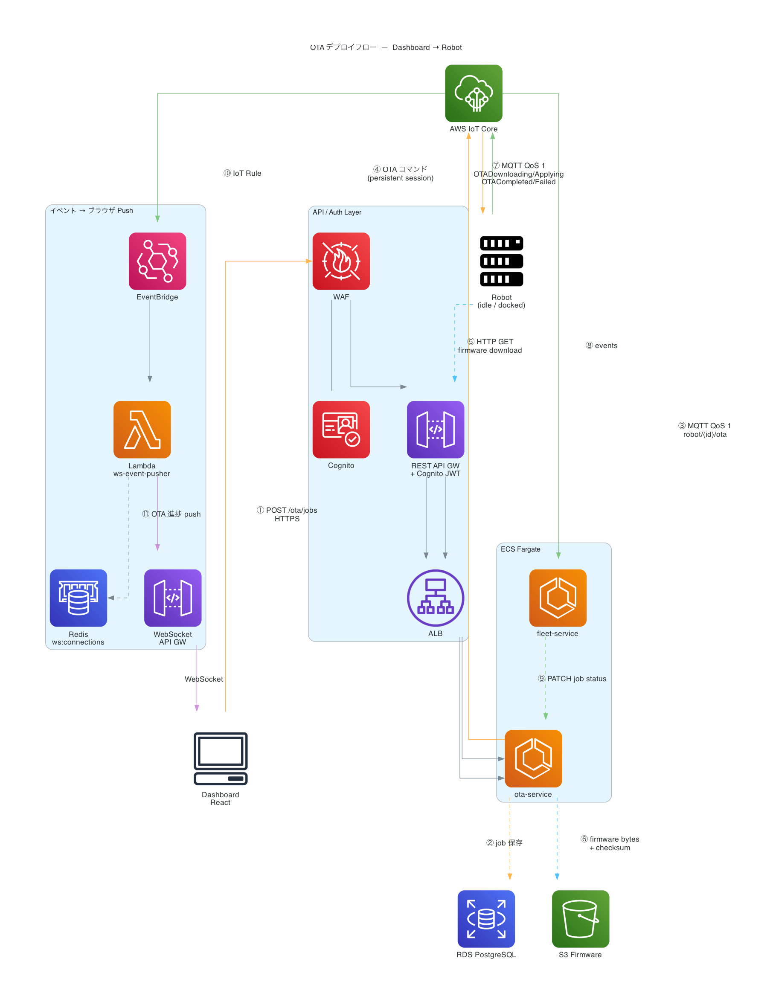
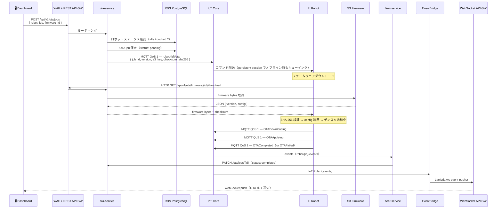
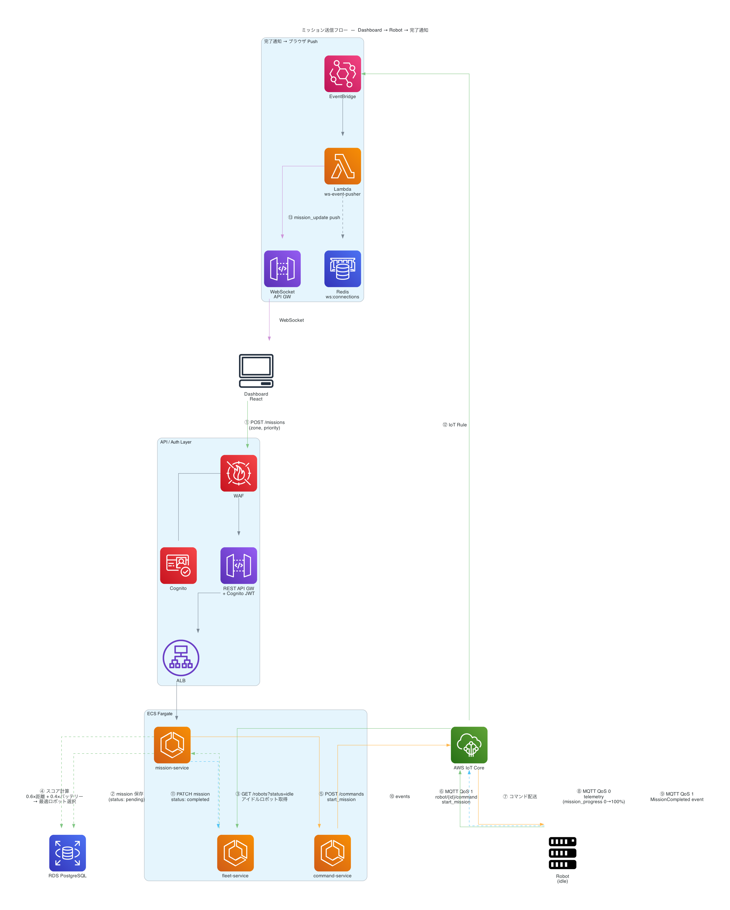
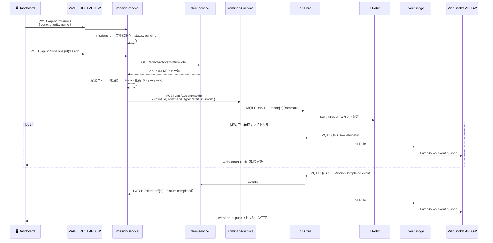

# RobotOps とは何か — 自律清掃ロボット管理プラットフォームを作って学んだこと

## はじめに

ソフトウェア開発の世界では DevOps、機械学習の世界では MLOps という概念が普及した。では、物理的なロボットをクラウドで管理する世界ではどうか。そこに登場するのが **RobotOps** という考え方だ。

本記事では、自律清掃ロボットのフリート管理プラットフォームをゼロから構築した経験をもとに、RobotOps の本質と、なぜそれが現代のロボティクス開発に欠かせないのかを解説する。

---

## RobotOps とは

RobotOps とは「**ロボットをクラウド管理されたインフラとして扱う**」という考え方だ。

```
DevOps  = Dev + Ops  → ソフトウェアの継続的デリバリー
MLOps   = ML  + Ops  → 機械学習モデルの継続的運用
RobotOps = Robot + Ops → ロボットフリートの継続的運用
```

「ロボット = ハードウェア」という認識では、ロボットが1台のうちは問題ない。だが10台、100台、1000台になったとき、個別に管理するアプローチは破綻する。RobotOps はその問題に対する解答だ。

---

## なぜ RobotOps が必要なのか

### ロボット管理の現実的な課題

物理ロボットの運用には、通常のサーバー管理にはない固有の難しさがある。

**1. ロボットは「ネットワークの外」に存在する**

サーバーは常にオンラインだが、ロボットは物理的に移動し、電波が届かない場所に入ったり、バッテリーが切れたりする。「今、どこにいて、何をしているか」を常に把握し続けること自体がひとつの課題だ。

**2. ファームウェア更新がハードウェアのリスクを伴う**

ソフトウェアのデプロイは失敗してもロールバックすれば済む。しかしロボットのファームウェア更新が失敗すると、ロボット本体が文鎮化するリスクがある。安全な OTA (Over-The-Air) 更新の仕組みが必要だ。

**3. リアルタイム性と信頼性のトレードオフ**

ロボットの位置情報やバッテリー残量は「今すぐ」知りたい。しかし毎秒テレメトリを送り続けると、ロボットが100台いれば毎秒100件のデータが飛んでくる。これをどう捌くかは設計上の本質的な問題だ。

**4. コマンドの信頼性保証**

「掃除を止めろ」というコマンドがロボットに届かなかった場合、どう検知して再送するか。ロボットがオフライン中に送ったコマンドは、再接続時に実行されるべきか。

---

## このプロジェクトのアーキテクチャが解いている問題

### フリート全体像

```
ロボット (Python agent)
    │
    │ MQTT (QoS 0/1)
    ▼
[ローカル: Mosquitto / 本番: AWS IoT Core]
    │
    ├─ telemetry (QoS 0, 毎秒) ──→ Kinesis → Lambda → TimescaleDB
    │
    └─ events   (QoS 1, 都度) ──→ EventBridge → fleet-service
                                              → mission-service
    │
    ▼
fleet-service / mission-service / command-service / ota-service
    │
    ▼
Dashboard (React + Three.js)
```

一見複雑に見えるが、各コンポーネントが解いている問題は明快だ。

---

### QoS 0 と QoS 1 の使い分け

MQTT には「メッセージ品質保証レベル (QoS)」がある。

| QoS | 保証 | 用途 |
|---|---|---|
| 0 | 届かなくてもいい (fire-and-forget) | テレメトリ (位置・バッテリー) |
| 1 | 必ず1回以上届く | コマンド・イベント・OTA通知 |

**テレメトリに QoS 0 を使う理由**

位置情報は毎秒届くので、1回くらい欠けても次の1秒後に新しいデータが来る。全部保証しようとすると帯域もブローカーの負荷も跳ね上がる。「多少欠損しても鮮度が大事」という判断だ。

**コマンドに QoS 1 を使う理由**

「緊急停止」が届かないのは困る。「充電に戻れ」が2回届いても、ロボット側でべき等処理すれば問題ない。信頼性を最優先する。

この使い分けは RobotOps における「信頼性と効率のバランス」の典型例だ。

---

### テレメトリパイプライン：なぜ Kinesis が必要か

```
ロボット → MQTT → Kinesis → Lambda (バッチ) → TimescaleDB
```

素朴に考えると「受け取ったら即 DB に書けばいい」と思うかもしれない。しかし：

- ロボット100台 × 毎秒1回 = **毎秒100インサート**
- DB への直接接続はコネクション数に上限がある
- 一時的な負荷スパイクで DB がダウンするリスク

Kinesis はバッファーとして機能する。Lambda がまとめて受け取り、バッチインサートすることで DB 負荷を平準化できる。

また TimescaleDB を選んだ理由は、テレメトリは**時系列データ**だからだ。「過去1時間のバッテリー推移」「昨日の清掃軌跡」といったクエリは、通常の PostgreSQL より時系列専用 DB の方が桁違いに速い。

---

### クリーンセッション = False の意味

ロボットエージェントは MQTT に接続する際、`clean_session=False` を指定している。

```python
mqtt.Client(client_id="robot_001", clean_session=False)
```

これにより：

- ロボットがオフライン中に送られた **QoS 1 コマンドがブローカーにキューイングされる**
- 再接続した瞬間、溜まっていたコマンドが配信される

「ロボットが一時的に圏外に入っても、戻ってきたら指示を実行する」を実現する設計だ。これがないと、オフライン中に送ったコマンドは消えてしまう。

---

### マルチロボットのタスク割り当て

ミッションをどのロボットに割り当てるかは、単純な「空いているロボット」では不十分だ。このプロジェクトでは正規化スコアで最適ロボットを選ぶ。

```python
score = 0.6 * distance_to_zone + 0.4 * battery_penalty
# スコアが低いロボットを選択
```

- **距離が近い方が良い** → 移動時間と電力の節約
- **バッテリーが多い方が良い** → ミッション途中でバッテリー切れを防ぐ

この重み付けは現場の要件によって変わる。「バッテリーを最優先するならウェイトを 0.7/0.3 に」といった調整ができる設計になっている。

---

### OTA 更新の設計

ファームウェア更新は RobotOps の花形だ。このプロジェクトでは以下の手順を踏む。

```
1. OTA ページでバージョン・設定を入力 → Register Firmware
   └─ サーバーが SHA-256 チェックサムを自動計算して保存

2. Deploy ボタン → OTA ジョブ作成 (rolling / canary 戦略を選択)
   └─ idle / docked のロボットにのみ配信 (安全チェック)

3. MQTT QoS 1 で対象ロボットに通知
   payload: {job_id, firmware_id, version, checksum_sha256, config}

4. ロボットが HTTP で OTA サービスからダウンロード
   GET /api/v1/ota/firmware/{id}/download

5. SHA-256 でチェックサム検証
   ├─ 不一致 → OTAFailed イベント → ロールバック → job: failed
   └─ 一致   → OTAApplying イベント → job: applying

6. 設定を適用 → ディスクに永続化 (バージョン番号も記録)
   ~/.robot_configs/{robot_id}.json
   {"step_per_cycle": 1.2, "_version": "v2.0.0"}

7. OTACompleted イベント → fleet-service → job: completed
   次回プロセス再起動時も設定・バージョンを復元

8. テレメトリに firmware_version を含めて送信
   → DB の robots テーブルを更新 → ダッシュボードに反映

9. 失敗時は旧設定に自動ロールバック
```

ジョブのステータス遷移は次のようになる：

```
pending → notified → downloading → applying → completed
                                            → failed (→ 自動ロールバック)
```

このステータス遷移は MQTT イベント (`OTADownloading`, `OTAApplying`, `OTACompleted`, `OTAFailed`) を fleet-service が受け取り、ota-service の REST API を叩くことで更新される。ロボット自身がステータスを能動的に報告する設計だ。

**rolling 戦略**: 全ロボットを順番に更新。1台失敗したら停止。
**canary 戦略**: まず1台だけ更新。問題なければ残りに展開。

ソフトウェアの Blue/Green デプロイと同じ考え方を、物理ロボットに適用している。

#### ファームウェアバージョンの可視化と重複デプロイ防止

ロボットは OTA 完了後、自分のバージョンをテレメトリに乗せて定期送信する。fleet-service がこれを受け取り `robots` テーブルの `firmware_version` 列を更新する。ダッシュボードの Fleet ページでは、各ロボットカードの名前の隣にバージョンバッジが表示される。

Deploy モーダルでは、デプロイ先バージョンとロボットの現在バージョンを照合し、**すでに同バージョンのロボットはチェックボックスを無効化**して選択不可にする。意図しない二重デプロイを UI レベルで防ぐ設計だ。

#### 「設定値」をファームウェアとして扱う設計

このプロジェクトでは「ロボットの移動速度 (`step_per_cycle`)」を OTA の配信対象としている。バイナリを書き換えるのではなく、設定値の変更を OTA として扱う。

最初はこれを「本物の OTA ではない」と感じるかもしれない。しかし重要なのは **OTA の仕組みを通じて変更を管理すること**だ。

```python
# ota-service: ファームウェアの「内容」はこの JSON
{"version": "v2.0.0", "config": {"step_per_cycle": 1.2}}

# チェックサムはこの JSON の SHA-256
# → 改ざん・通信エラーを検知できる

# robot_agent: 適用後はディスクに保存
~/.robot_configs/robot_001.json
# → プロセスを再起動しても設定が維持される
```

この設計はクラウドの **Feature Flag** や **Remote Config** (Firebase Remote Config, AWS AppConfig に相当) に近い。組み込みロボットでは binary firmware のフラッシュになるが、アーキテクチャの骨格は同じだ:

| 要素 | 組み込みロボット | このプロジェクト |
|---|---|---|
| 配信 | MQTT QoS 1 | MQTT QoS 1 |
| ダウンロード | S3 Presigned URL | OTA service HTTP endpoint |
| 完全性検証 | SHA-256 checksum | SHA-256 checksum ✅ |
| 適用 | フラッシュメモリ書き込み | ディスク (JSON) + 変数更新 |
| 永続化 | 不揮発メモリ | ~/.robot_configs/*.json ✅ |
| ロールバック | Bootloader fallback | 旧設定を変数に復元 ✅ |
| ステータス追跡 | ACK イベント | MQTT event → REST API ✅ |
| バージョン可視化 | デバイス管理コンソール | テレメトリ経由で DB → ダッシュボード ✅ |

配信・検証・永続化・ロールバック・追跡・可視化という OTA の本質的な仕組みはすべて実装されている。

---

## AWS アーキテクチャ全体図



### データフロー別の読み方

| フロー | 経路 |
|---|---|
| **テレメトリ** | Robot → IoT Core → Kinesis → Lambda → TimescaleDB |
| **イベント通知** | Robot → IoT Core → EventBridge → Lambda → Redis pub/sub → WebSocket → Dashboard |
| **コマンド送信** | Dashboard → WAF → REST API GW → ALB → command-service → IoT Core → Robot |
| **OTA デプロイ** | Dashboard → WAF → REST API GW → ALB → ota-service → S3 |
| **OTA ダウンロード** | Robot → REST API GW → ALB → ota-service (← S3) |
| **リアルタイム更新** | Redis SUBSCRIBE → Lambda → WebSocket API GW → Dashboard push |
| **CI/CD** | GitHub Actions → ECR → ECS Fargate |

---

## ローカルと本番の構造的な違い

開発中に最も学びが深かったのが「ローカルでの MQTT Bridge がやっていることを、本番では AWS のどのサービスが担うか」という対応関係だ。

| 役割 | ローカル | 本番 AWS |
|---|---|---|
| MQTT ブローカー | Mosquitto (Docker) | AWS IoT Core |
| テレメトリ受信 | MQTT Bridge (fleet-service 内) | Kinesis → Lambda |
| イベント処理 | MQTT Bridge → HTTP | IoT Core HTTP Action → fleet-service |
| ロボット認証 | なし (開発用) | mTLS X.509 証明書 |
| WebSocket | command-service (直接) | API Gateway WebSocket |
| ストレージ | PostgreSQL (Docker) | RDS + TimescaleDB |

ローカルは「1プロセスが全部やる」、本番は「AWS マネージドサービスが役割分担する」という違いだ。コードが変わるわけではなく、**どのサービスがトリガーを担うか**が変わる。

---

## データフロー詳解

AWS 全体図はすべてのサービスを網羅しているため複雑に見える。ここでは 3 つの主要フローを個別に解説する。

---

### 1. テレメトリフロー — ロボットの状態がブラウザに届くまで

ロボットが 1 秒ごとに送るテレメトリ（位置・バッテリー・状態）がダッシュボードに表示されるまでの流れ。





#### ステップ解説

| # | コンポーネント | 処理内容 |
|---|---|---|
| 1 | **Robot** | MQTT QoS 0 で `robot/{id}/telemetry` に毎秒 publish |
| 2 | **AWS IoT Core** | IoT Rule 1 → **Kinesis Data Streams** へ転送（バッファリング） |
| 3 | **Kinesis** | 2 shards で最大 100 ロボット × 1 s を受け止める |
| 4 | **Lambda telemetry-processor** | バッチで起動、RDS `robots` テーブルを UPSERT（最新状態） |
| 5 | **Lambda telemetry-processor** | TimescaleDB `telemetry` テーブルに INSERT（時系列履歴） |
| 6 | **AWS IoT Core** | IoT Rule 2 → **EventBridge** へも転送（リアルタイム経路） |
| 7 | **Lambda ws-event-pusher** | EventBridge に起動される。Redis `ws:connections` から接続中ブラウザ ID を全取得 |
| 8 | **WebSocket API GW** | `post_to_connection()` で各ブラウザに `telemetry_update` を push |
| 9 | **Dashboard** | WebSocket メッセージ受信 → Three.js マップ・Recharts グラフをリアルタイム更新 |

> **QoS 0 の理由**: テレメトリは次の 1 秒後に最新値が届くため、1 件ロスしても問題ない。帯域とブローカー負荷を下げるため意図的に非保証。

---

### 2. OTA デプロイフロー — ファームウェアをロボットに届けるまで

ダッシュボードから「Deploy」を押した後、ロボットが新しいファームウェアを適用するまでの流れ。





#### ステップ解説

| # | コンポーネント | 処理内容 |
|---|---|---|
| 1 | **Dashboard** | 対象ロボット・ファームウェアを選択して POST `/api/v1/ota/jobs` |
| 2 | **WAF + REST API GW** | リクエストルーティング・WAFフィルタリング |
| 3 | **ota-service** | ロボットのステータス確認（`idle` / `docked` のみ許可） |
| 4 | **ota-service** | OTA job を PostgreSQL に保存（`status: pending`） |
| 5 | **ota-service** | MQTT QoS 1 で `robot/{id}/ota` トピックに publish |
| 6 | **AWS IoT Core** | QoS 1 + persistent session → ロボットがオフラインでもキューイング |
| 7 | **Robot** | OTA コマンド受信 → REST API GW 経由で S3 からファームウェアをダウンロード |
| 8 | **Robot** | SHA-256 checksum を検証。不一致なら適用せず `OTAFailed` イベントを送信 |
| 9 | **Robot** | config を変数に適用 + `~/.robot_configs/` へ永続化 |
| 10 | **Robot** | MQTT QoS 1 で `OTADownloading → OTAApplying → OTACompleted` イベントを送信 |
| 11 | **fleet-service** | events を受信 → HTTP PATCH で ota-service の job status を更新 |
| 12 | **EventBridge → Lambda ws-event-pusher** | OTA イベントをブラウザにリアルタイム push |

> **安全設計のポイント**: ① idle/docked ロボットのみ対象 ② QoS 1 でコマンドを保証 ③ checksum で改ざん検知 ④ 失敗時は旧バージョンで継続稼働

---

### 3. ミッション送信フロー — 清掃指示がロボットに届くまで

オペレーターがミッションを作成し、最適なロボットを自動選択して清掃が始まるまでの流れ。





#### ステップ解説

| # | コンポーネント | 処理内容 |
|---|---|---|
| 1 | **Dashboard** | ゾーン・優先度を入力して POST `/api/v1/missions` |
| 2 | **mission-service** | missions テーブルに保存（`status: pending`） |
| 3 | **mission-service** | fleet-service からアイドルロボット一覧を取得し、最適なロボットを選択 |
| 4 | **mission-service** | HTTP POST で command-service に `start_mission` コマンドを依頼 |
| 5 | **command-service** | MQTT QoS 1 で `robot/{id}/command` に publish |
| 6 | **Robot** | コマンドを受信してゾーンへ移動、清掃を実行 |
| 7 | **Robot** | `mission_progress` を含むテレメトリを毎秒送信 → ブラウザにリアルタイム表示 |
| 8 | **Robot** | 完了後に `MissionCompleted` イベントを MQTT QoS 1 で送信 |
| 9 | **fleet-service** | events を受信 → mission-service の status を `completed` に更新 |
| 10 | **EventBridge → Lambda ws-event-pusher** | ミッション完了をブラウザにリアルタイム push |

---

## RobotOps が DevOps/MLOps と異なる点

| 観点 | DevOps | MLOps | RobotOps |
|---|---|---|---|
| デプロイ対象 | コード | モデル | ファームウェア + コード |
| 失敗のリスク | サービス停止 | 精度劣化 | **物理的損傷** |
| 状態管理 | ステートレス設計 | モデルバージョン | **リアルタイム物理状態** |
| ネットワーク | 常時接続前提 | 常時接続前提 | **断続的接続を前提** |
| スケール単位 | サーバーインスタンス | GPU | **物理ロボット台数** |

RobotOps 固有の難しさは「**物理世界との境界**」にある。サーバーはコードで完全に制御できるが、ロボットは物理法則に支配された世界で動いている。

---

## まとめ：RobotOps から学べること

このプロジェクトを通じて実感したのは、RobotOps は単なるロボット管理ツールではなく、**「不確実な物理世界と信頼性の高いクラウドシステムをどう繋ぐか」**という設計哲学だということだ。

- **信頼性と効率のトレードオフ** → QoS 0/1 の使い分け
- **スケーラビリティ** → Kinesis によるバッファリング
- **安全な更新** → OTA の rolling/canary 戦略
- **断続的接続への対応** → persistent session + コマンドキューイング
- **リアルタイム可視化** → WebSocket + Redis pub/sub

これらはすべて「ロボットが物理世界で動く」という制約から導き出された設計判断だ。

自律ロボットが物流・清掃・農業・建設など様々な分野に展開される時代に、RobotOps のスキルセットはますます重要になるだろう。

---

*本記事のプロジェクトは [GitHub](https://github.com/) で公開予定。*
